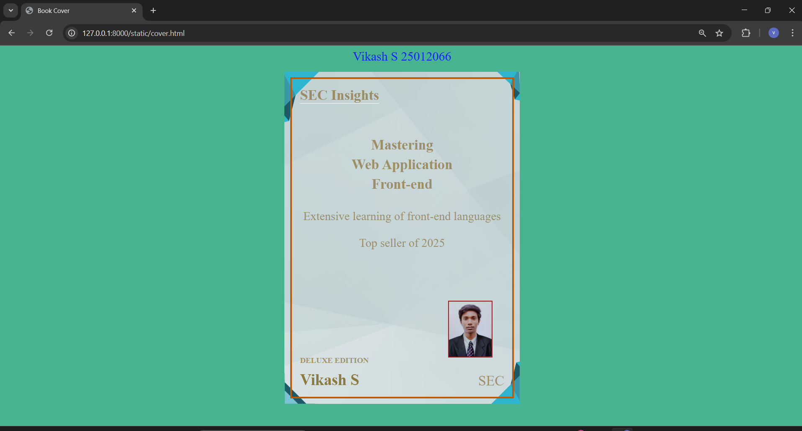

# Ex.06 Book Front Cover Page Design
## Date: 6-10-2025

## AIM:
To design a book front cover page using HTML and CSS.

## DESIGN STEPS:

### Step 1:
Create a Django Admin project.

### Step 2:
Create an app in the Django interface.

### Step 3:
Create a folder named 'static' in the app folder.

### Step 4:
Create a new HTML file in the static folder.

### Step 5:
Write the HTML code with relevant CSS properties.

### Step 6:
Choose the appropriate style and color scheme.

### Step 7:
Insert the images in their appropriate places.

### Step 8:
Publish the website in the LocalHost.

## PROGRAM:
```
cover.html
<!DOCTYPE html>
<html lang="en">
<head>
  <meta charset="UTF-8">
  <title>Book Cover</title>
  <link rel="stylesheet" href="style.css">
</head>
<body>
  <header>Vikash S 25012066</header>
  <div class="cover">
    <div class="top">SEC Insights</div>

    <div class="title">
      Mastering<br>
      Web Application <br>
      Front-end
    </div>

    <div class="subtitle">
      Extensive learning of front-end languages<br><br>
      Top seller of 2025
    </div>

    <div class="deluxe">DELUXE EDITION</div>
    <div class="author">Vikash S</div>
    <div class="publisher">SEC</div>

    
  </div>
</body>
</html>


style.css
body {
  margin: 10px;
  font-family: "Times New Roman", serif;
  background-color: rgb(71, 179, 143);
}
header{
    color: rgb(23, 31, 242);
    font-size: xx-large;
    text-align: center;
}

.cover {
  width: 600px;
  height: 850px;
  margin: 20px auto;
  
  background-image:url(cover.png);
  background-repeat: no-repeat;
  background-attachment: scroll;
  background-size: contain;
  background-position: center;
  color: rgba(121, 80, 9, 0.542);
  outline: 5px solid rgb(185, 92, 11);;
  outline-offset: -20px;
  padding: 40px;
  box-sizing: border-box;
  position: relative;
}

.top {
  font-size: 36px;
  font-weight: bolder;
  margin-bottom: 40px;
  border-bottom: 2px solid white;
  display: inline-block;
}

.title {
  font-size: 36px;
  font-weight: bold;
  text-align: center;
  line-height: 1.4em;
  margin: 40px 0;
}

.subtitle {
  font-size: 30px;
  text-align: center;
  margin-bottom: 80px;
}

.deluxe {
  font-size: 20px;
  font-weight: bolder;
  position: absolute;
  bottom: 100px;
  left: 40px;
}

.author {
  font-size: 40px;
  font-weight: bold;
  position: absolute;
  bottom: 40px;
  left: 40px;
  color: rgb(141, 123, 61);
}

.publisher {
  position: absolute;
  bottom: 40px;
  right: 40px;
  font-size: 36px;
}

.author-photo {
  width: auto;
  height: 140px;
  position: absolute;
  bottom: 120px;
  right: 70px;
  border: 3px solid rgb(170, 25, 25);
}

```

## OUTPUT:


## RESULT:
The program for designing book front cover page using HTML and CSS is completed successfully.
